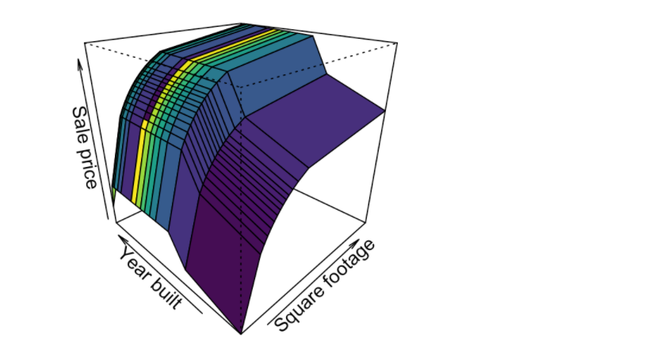
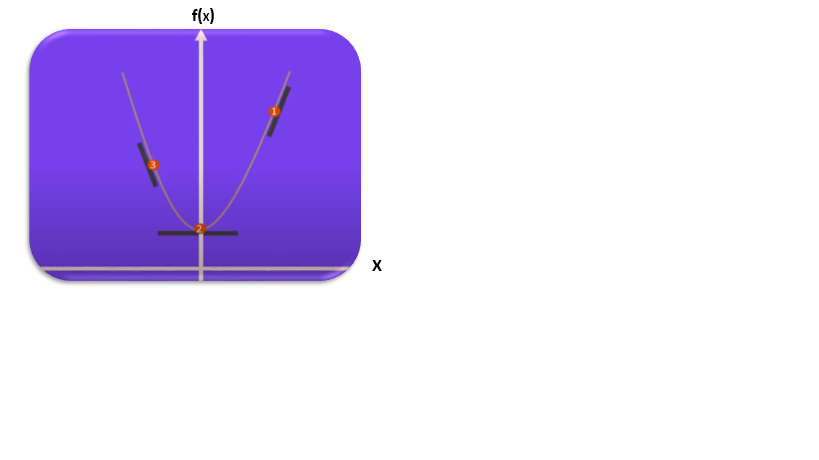

```{r setup, include=FALSE}
knitr::opts_chunk$set(echo = TRUE)
```
*   Pronosticar la probabilidad de que un paciente pueda agravarse como consecuencia del COVID 19. (Siempre y cuando exista )
* Segmentar clientes basados en atributos comunes y en comportamientos de compra
* Predecir la probabilidad de que un cliente abandone una organización.
* Cuantificar la probabilidad de falla de un dispositivo.
* Predecir si un cliente va a estar en mora en los próximos meses.
* Predecir una fuga de cliente con información del cliente (churn ananlysis).


# Aprendizaje supervisado


En un modelo predictivo implica la predicción de una variable en términos de otras variables. Por ejemplo el valor de una vivienda se puede predecir en términos de diferentes atributos de la vivienda. En estos modelos predictivos se dispone de variables predictivas (X), que predecen una variable respuesta. 

* Las variables predictivas se conocen también como variable independiente, atributo, feature, predictor.
* Las variables objetivo se conocen como variable dependiente, respuesta, variable respuesta.

Los modelos anteriormente descritos se conocen como modelos de aprendizaje supervisado. La palabra supervizada refleja el hecho de que la variable objetivo auxilia o supervisa el aprendizaje.Dados los datos, el algoritmo de aprendizaje optimiza una función para encontrar una combinación de las variables (features) que esté lo más cercano al valor verdadero de la variable objetivo.

La mayoría de los modelos supervisados se pueden clasificar en dos clases de modelos: 

* Problemas de regresión




* Problemas de clasificación
En este caso el pronostico del resultado a predecir es una variable continua.
Por ejemplo en el pronostico del precio de una vivienda, la variable a predecir es continua y dada las combinaciónes de los predictores el valor que se generará estára en los reales.

* Problemas de clasificación
Cuando la variable a predecir es categórica, el problema se denomina un problema de clasificación, algunos ejemplos de este tipo de pronosticos son:

* Predecir si una persona tomará un crédito que oferte un banco.
* Clasificar si una persona caerá en cuidados intensivos basado en su información sociodemográfica.


# Aprendizaje no supervisado
* No hay etiquetas.
* Creación de clusters
* Técnicas de reducción de dimensionalidad


```{r}
library(ggplot2)
```

# Mínimos cuadrados 

$$ y_i = \beta_0+\beta_1x_i+e_i=\hat{y}_i+e_i$$

$i = 1,\ldots n$

$e_i = y_i - \hat{y}_i$, la diferencia entre el valor real y el valor pronosticado es el error.


# Minimizar la suma de cuadrados del error
$$MSE = \sum_{i=1}^{n}e_i^2 = \sum_{i=1}^{n}(y_i - \beta_0-\beta_1x_i)^2$$
$$f(\beta_0, \beta_1) = \sum_{i=1}^{n}(y_i - \beta_0-\beta_1x_i)^2$$
$$f(x, y) = \sum_{i=1}^{n}(peso_i - x - y * estat_i)^2$$


* Objetivo: Encontrar los $\mathbf{\beta}$ que minimizan el MSE.

* Paso 1A: derivar MSE con respecto $\beta_0$ e igual a 0
* Paso 1B: derivar MSE con respecto $\beta_1$ e igual a 0

$$\frac{d\left(\sum_i^{n}(y_i - \beta_0+\beta_1x_i)^2\right)}{d\beta_0} = 0 = \sum_{i=1}^{n}-2(y_i- \beta_0-\beta_1x_i)=0$$
$$\frac{d\left(\sum_i^{n}(y_i - \beta_0+\beta_1x_i)^2\right)}{d\beta_1} = 0= \sum_{i=1}^{n}-2(y_i- \beta_0-\beta_1x_i)x_i=0$$
Paso 2: Despejar $\beta_0$ y $\beta_1$ 
Despejando Beta 0 de la primera ecuación 

$$\hat{\beta_0} = \sum_{i=1}^{n}(y_i- \beta_1x_i)=0 = \overline{y}-\beta_1\overline{x} $$
$$\hat{\beta_1}=\frac{\sum_{i=1}^n(x_i-\overline{x})(y_i-\overline{y})/n}{\sum_{i=1}^n(x_i-\overline{x})^2/n}$$

```{r}
data(iris)
# x: ancho del patalo, y: longitud del petalo
plot(iris$Petal.Width ~ iris$Petal.Length )
```

```{r}
modelo <- lm(iris$Petal.Width ~ iris$Petal.Length , data = iris)
plot(iris$Petal.Width ~ iris$Petal.Length, pch = 20 )
abline(modelo)
```

```{r}
summary(modelo)
```

```{r}
beta1 <- cov(iris$Petal.Length, iris$Petal.Width) / var(iris$Petal.Length)
beta1
```

```{r}
beta0 <- mean(iris$Petal.Width) - 0.4157554 * mean(iris$Petal.Length)
beta0
```
Igual que el procedimieno de R :)


# Se puede resolver con un paquete de optimización ##########

Minimizar:
$$MSE = \sum_{i=1}^{n}e_i^2 = \sum_{i=1}^{n}(y_i - \beta_0-\beta_1x_i)^2$$
```{r}
data(iris)
beta_inicial <- c(0, 30)

library(nloptr)
x <- iris$Petal.Length
y <-  iris$Petal.Width

mse <- function(beta){
  beta_0 <- beta[1]
  beta_1 <- beta[2]
  
sum((y - beta_0 - beta_1*x)^2)  
}

# Sin restricción

opts = list("algorithm" = "NLOPT_LN_BOBYQA", "xtol_rel" = 1.0e-16,
              "maxeval" = 10000)

nloptr(x0 = beta_inicial, eval_f = mse, 
       eval_grad_f = NULL, opts = opts)

```


```{r}
# Regresión Con restricciones poner el beta_0 casi igual a cero
beta_inicial <- c(0, 30)
opts = list("algorithm" = "NLOPT_LN_BOBYQA", "xtol_rel" = 1.0e-16,
              "maxeval" = 10000)

nloptr(x0 = beta_inicial, eval_f = mse, lb = c(-0.01,-Inf), ub = c(0.01,Inf),
       eval_grad_f = NULL, opts = opts)

```

## Método de gradiente

```{r}

datos <- read.csv("houses_portland.csv")
head(datos)
```

Se analizará la relación entre el área y el precio de unas viviendas:

```{r}
plot(datos$area, datos$price, pch = 20)
```

Da las unidades tan diferentes de las dos variables estas se estandarizan:

```{r}
datos$area_st <- (datos$area - mean(datos$area)) / sd(datos$area)
datos$price_st <- (datos$price - mean(datos$price)) / sd(datos$price)
```

Las relaciones no se afectan 
```{r}
plot(datos$area_st, datos$price_st, pch = 20)
```

El modelo de regresión líneal toma la siguiente forma:

$$y=\beta_0 + \beta_1x_1 + \beta_2x_2 + \beta_x_p$$, donde:

* y es la respuesta
* $\beta_0$ es el intercepto
* $\beta_1$ es el coeficiente asociado a $x_1$
* $\beta_p$ es el coeficiente asociado a $x_p$

Los valores de $\beta$ se conocen como los coeficientes de regresión. Estos valores se estiman en un proceso de ajuste usando la función de perdida cuadrático:

$$\sum_{i=1}^{n}(\hat{y}_i-y_i)^2$$

Esta función de perdida se conoce como suma de cuadrados del error.

```{r}
modelo <- lm(price_st ~ area_st, data = datos)
plot(datos$area_st, datos$price_st, pch = 20, xlab = "Área (estandarizado)", ylab = "Precio (estandarizado)")
abline(modelo)

```

# Introducción
En el algoritmo gradiente descendende se utiliza para encontrar máximos y mínimos de una función. Su nombre viene dado por que si fueramos por ejemplo unos seres bidimensionales y quisieramos encontrar el punto más bajo de una curva, por ejemplo una parabola, empezariamos a descender si encontramos pendientes positivas, ese descenso se traduce en tansladarse hacia la izquierda. Por otro, si la pendiente fuera negativa, empezariamos de igual forma a descender pero esto se traduce en moverse hacia la derecha.



El algoritmo de gradiente descentende se puede escribir como sigue:

$$x^{(i+1)}:=x^{(i)}-\alpha\frac{df(x^{(i)})}{dx^{(i)}}$$
En esta formulación $x^{(i+1)}$ hace referencia a la iésima iteración, se comienza con un punto arbitrario llamado  $x^{(0)}$, en este algoritmo existe un parámetro denominado la tasa de aprendizaje $\alpha$. Después de varias iteraciones se encontrará la solución que minimiza la curva.

En el caso multivariado, este algoritmo se puede escribir como:

$$\mathbf{x}^{(i+1)}=\mathbf{x}^{(i)}-\alpha\nabla F(x)$$

 O escrito en términos de las derivadas parciales:
 
$$\left(x_1^{(i+1)},\ldots x_p^{(i+1)}\right)'=\left(x_1^{(i)},\ldots x_p^{(i)}\right)' -\alpha \left( \frac{\partial f(x_1\ldots x_p)}{\partial x_1}, \ldots \frac{\partial f(x_p\ldots x_p)}{\partial x_1}\right)'$$ 
 
 Ilustraremos la técnica con un ejemplo: Maximizaremos la función:
 $$y=4+(x-2)^2=x^2-2x+8$$
 
```{r}
#curve(sin(x))
f <- function(x) 4+(x-2)^2
curve(f(x), xlim = c(-10, 10))
```
 
La derivada de esa función es:
 
$$f'(x)=2x-2$$

Definimos las dos funciones:

```{r}
f <- function(x) x^2 - 2*x + 8
fprima <- function(x) 2*x -2
```

Aplicamos el algoritmo iterativo:

$$x^{(i+1)}:=x^{(i)}-\alpha\frac{df(x^{(i)})}{dx^{(i)}}$$

```{r}
set.seed(12345)
xprevio <- round(runif(1, -20, 20),1)
alpha <- 0.1

iteracion <- 0
grafico <- ggplot(data.frame(x = c(-10, 10)), aes(x = x)) +
        stat_function(fun = f)
x_i <- xprevio -  alpha * fprima(alpha) 

while(abs(x_i-xprevio) >  1e-12){
xprevio <- x_i
df <- data.frame(iter = 1, x_i = x_i, f = f(x_i))


x_i <- xprevio -  alpha * fprima(x_i) 
actualizacion <- c(iter = 2, x_i = x_i, f = f(x_i))
df <- rbind(df, actualizacion)
grafico <- grafico + geom_point(data = df, 
             mapping = aes(x = x_i, y = f), 
             size = 1)
iteracion <- iteracion + 1
grafico
}
```

 La técnica de gradiente descendiente puede escribirse como una función en términos de la tolerancia, el valor inicial y en términos del valor de castigo $\alpha$.
 
Colocaremos un valor arbitrario de inicialización:

```{r}
gduniv <- function(f, x_inicial, alpha, tolerancia = 1e-12){
  fprima <- Deriv::Deriv(f) 
  x_i <- x_inicial
  iteracion <- 0

  while(abs(x_i-xprevio) > tolerancia){
    xprevio <- x_i
    x_i <- xprevio -  alpha * fprima(x_i) 
    iteracion <- iteracion + 1
  }
resultado <- list(x_i, iteracion)
names(resultado) <- c("sol", "iter")
return(resultado)
}  
f <- function(x) x^2 - 2*x + 8
gduniv(f, x_inicial = 8, alpha = 0.1)
```

# Función de costo

El objetivo que se quiere lograr en un problema de predicción, es encontrar los parámetros  que minimiza la suma de cuadrados del error:

$$C(\beta_0, \beta_1) = \sum_{i=1}^{n}(\hat{y}_i-y_i)^2$$

Se va a realizar un ajuste con unos valores de $\beta_0$ y $\beta_1$ arbitarios, $\beta_0=0$, $\beta_1=0$:

```{r}
vctr_bata <- c(-1,1)
plot(datos$area_st, datos$price_st, pch = 20, xlab = "Área (estandarizado)", ylab = "Precio (estandarizado)")
abline(a = vctr_bata[1], b = vctr_bata[2])

```


Calcularemos la función de costo con este ajuste arbitrario que realizamos ($\beta_1 = 1$, $\beta_2 = 1$):

```{r}
x <- datos$area_st
y <- datos$price_st
vctr_beta <- c(-1,1)
mean((y - vctr_beta[1] - vctr_beta[2] *  x)^2)
```

```{r}
mse <- function(beta_0, beta_1) 
  mean((y - beta_0 - beta_1 *  x)^2)

```

Ejercicio: realizar aplicación para la regresión.