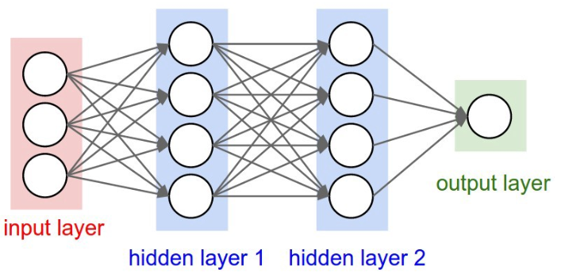

## José Fernando Zea (ML - Konrad Lorenz)

# Motivación 

Hasta el momento se ha trabajado una variedad de modelos que permiten solucionar problemas de clasificación o de regresión de una manera bastante sencilla.  En este caso, se hablará de un modelo cuya manipulación de datos es diferente a la de los modelos tradicionales: Las Redes Neuronales. Mediante un diversas interacciones entre los elementos que componen la Red Neuronal Artifical, se intenta imitar la manera en que los seres vivos toman decisiones. Así, no es sorprendente que hayan aplicado con éxito en realizar tareas de reconocimiento de imágenes, reconocimiento de voz e incluso para autos inteligentes (\textit{self-driving cars}). 

# Descripción de la Ténica

Con el objetivo de imitar la toma de decisiones de los seres vivos, las redes neuronales se componen de conexiones entre neuronas a través de diferentes capas. 
Como se puede apreciar en la Figura 1, las Redes Neuronales se componen de una capa de \textit{inputs}, que son los datos con los que el investigador va a entrenar la red (sus \textit{features}). Estos datos pasan a la siguiente capa mediante una conexión (las líneas negras), que realizan operaciones sobre los datos. Una vez en la siguiente capa, cada neurona recopila la información que viene de la capa anterior, agrega la información y realiza una operación sobre el conjunto de datos (conocido como función de activación). Estos datos pasan a la siguiente capa de la misma manera, para al final combinarse en una predicción (que debe parecerse a la variable dependiente).


De esta forma, se puede ver que los datos con los que la red realiza todo su proceso de optimización no son los mismos que ingresan a ella. Una vez entran, estos pasan por un proceso de transformación que permite capturar no linealidades en el proceso generador de los datos. Así, con las redes neuronales es posible modelar relaciones más complejas que las que se consiguen en modelos más sencillos como la regresión lineal o la regresión logística. 

Adicionalmente, es posible afirmar que la regresión lineal y la regresión logística pueden ser modelados utilizando una red neuronal con una sola neurona. La siguiente figura muestra gráficamente cómo realizar la siguiente regresión: 
$$ y_i = f(w_1 x_1 + w_2 x_2 + w_3 x_3 )$$
La red neuronal le asigna un peso $w_i$ a cada una de las variables $x_i$, las suma, y luego realiza una operación sobre este resultado. Si se tratara de una regresión lineal, no realiza nada (multiplica por uno), mientras que si es una regresión logística, la función $f(x'w)$ sería la logística: 

$$ f(x'w) = \frac{1}{1 + e^-{x'w}}$$
 


Sin embargo, ya que se han trabajado funciones que permiten realizar este tipo de modelos, es mejor profundizar en los más complejos. Así, se trabajarán redes neuronales de una capa y de más de una capa para capturar relaciones más complejas entre las variables del conjunto de información. 

Como nota adicional, se recalca que existen muchos tipos de funciones $f()$, conocidas comunmente como funciones de activación. Utilizándolas es posible introducir no-linealidades o nuevos comportamientos sobre los datos que conforman la red neuronal. 

# Ejemplo 1 - Red Neuronal de una capa (Clasificación)

Anteriormente se utilizó la regresión logística para clasificar dos tipos de flores utilizando información de sus pétalos y su tallo. En este caso, se tomará el mismo conjunto de información para realizar la clasificación sobre los tres tipos de flores disponibles: Iris Virginica, Iris Verisicolor e Iris Setosa. 

```{r message = FALSE, warning = F}
# El primer paso es cargar los datos

data(iris)

# Se definen los conjuntos de entrenamiento y validación 
indices_entrenamiento <- sample(1:nrow(iris), 0.7 * nrow(iris))
indices_prueba <- setdiff(1:nrow(iris), indices_entrenamiento)

# Utilizando los índices se conforman los conjuntos de datos.

datos_entrenamiento <- iris[indices_entrenamiento,]
datos_prueba <- iris[indices_prueba,]
```

Con los conjuntos de entrenamiento y validación separados se prosigue a realizar el ajuste de la red neuronal de una capa sobre el conjunto de datos iris utilizando la función \texttt{nnet}. Esta funciona de igual manera que \texttt{lm} o \texttt{glm}. 

```{r message = FALSE, warning = F}
library(nnet)
mod_1 = nnet(Species ~ ., datos_entrenamiento, size = 3)
```
Se puede observar que para poder ajustar la red neuronal tuvieron que hacerse 100 iteraciones. Una vez realizado el ajuste del modelo, se realiza la predicción sobre el conjunto de información de prueba. 
```{r}
prediction = predict(mod_1, datos_prueba, type = "class")
real_class = datos_prueba$Species
cat("Matriz de Confusión: \n")

table(prediction, real_class)
```

# Ejemplo 2 - Red Neuronal de una capa (Regresión)

Una firma de ingeniería ha trabajado con diferentes tipos de materiales para construir edificios, puentes y carreteras. Ellos han recolectado una gran variedad de datos sobre el tipo de materiales que utilizan en el concreto y su fuerza. Para la firma es de vital importancia predecir la fuerza de los materiales que van a utilizar debido a que diferentes condiciones geológicas podrían requerir estructuras más o menos sólidas. 

En el archivo \texttt{concreto.xlsx} se encuentra una base de datos de los materiales utilizados para la elaboración del concreto y la fuerza resultante. 

```{r message = FALSE, warning = F}
library(readxl)
concreto = read_excel("concreto.xls")
```

Debido a que los datos poseen diferentes rangos, es importante realizar un proceso de normalización para evitar que los optimizadores tomen mucho tiempo en encontrar la solución para los parámetros de la red. 

```{r}
# Se define una función de normalización. Esta función toma un valor, 
# le resta el mínimo y la divide por el rango de los datos. De esta forma, 
# se crea un índice entre 0 y 1. Aplicándola sobre todas las variables, 
# se deja el conjunto de datos en los mismos rangos. 

normalize = function(x) {
 return((x - min(x)) / (max(x) - min(x)))
}

concreto = as.data.frame(lapply(concreto, normalize))
colnames(concreto) = c("cemento", "escoria", "ceniza", "agua", 
                       "plastif", "grueso", "fino", "edad", "fuerza")
```

Una vez realizada la normalización sobre las variables, es importante dividir el conjunto de i nformación en entrenamiento y prueba antes de realizar el ajuste del modelo. De esta forma, es posible verificar la capacidad de generalización que tiene. 

```{r}
# Índices
train_index <- sample(1:nrow(concreto), 0.7 * nrow(concreto))
test_index <- setdiff(1:nrow(concreto), train_index)

# Utilizando los índices se conforman los conjuntos de datos.

datos_entrenamiento <- concreto[train_index,]
datos_prueba <- concreto[test_index,]
```
Teniendo las variables de una manera adecuada, es posible ajustar una red neuronal que tenga una capa oculta con una cantidad arbitraria de neuronas. No hay una fórmula que diga cuántas neuronas deben existir en la capa oculta, por lo que se deja a discresión del investigador (quien puede tomar diferentes valores y ver cuál genera mejores resultados). Por cosa del ejemplo, se utilizarán 5 neuronas para la capa oculta. Para ello se utilizará el paquete \texttt{neuralnet}, que viene con una función para implementar de manera similar a las trabajadas anteriormente.

```{r}
library(neuralnet)
set.seed(1)
mod_2 <- neuralnet(fuerza ~ cemento + escoria+  ceniza + agua +
                     plastif +  grueso + fino + 
                     edad,  data = datos_entrenamiento, hidden = 5)
```

Una vez ajustada la red neuronal, es posible visualizarla utilizando la función plot. 

```{r}
plot(mod_2)
```

Con el gráfico anterior se puede visualizar que cada una de las capas tiene asociado un "intercepto" (que es comunmente conocido como un sesgo). Además, es posible ver cómo cada una de las neuronas recoge una combinación lineal diferente de las variables explicativas con las que se está alimentando el modelo. Finalmente, en la parte inferior se encuentra la suma de residuales al cuadrado, y la cantidad de iteraciones. Al igual que en la regresión lineal, entre menor sea la suma de residuales al cuadrado, mejor es el ajuste del modelo.  

Este gráfico proporciona únicamente métricas sobre el desempeño del modelo utilizando los datos de prueba. Naturalmente surge una inquietud respecto al desempeño de la red neuronal en el conjunto de validación. Para esto, se utilizará el como medida de ajuste la correlación entre los valores reales de la fuerza y los valores predichos. 

```{r}
# La función compute devuelve las neuronas y las predicciones. 
resultados = compute(mod_2, datos_prueba[, 1:8])
fuerza_pred = resultados$net.result
fuerza = datos_prueba$fuerza
cat("La correlación entre la predicción y los datos reales es: ")
cor(fuerza, fuerza_pred)

```

La correlación de 0.94 indica que existe una fuerte relación lineal entre los valores predichos y los valores reales, por lo que la red conoce en qué dirección va la relación de las variables. 

Sin embargo, no es una medida que diga qué tan acertado es el modelo. Por esta razón, se recomienda calcular el RMSE para ambos conjuntos de información y validar el desempeño de la red. 

## Ejemplo Adicional - h2o

Cuando el conjunto de datos es demasiado grande o cuando se tienen demasadas capas o neuronas (por ejemplo, cuando se realiza una red neuronal profunda), es más recomendable utilizar paquetes optimizados para estos procesos. Ejemplos de estos son el paquete h2o, con el que se realizará el mismo ejemplo anterior. 

```{r message = FALSE, warning = F, results='hide'}
library(h2o)
# Se da inicio a h2o 
h2o.init()

# Toca convertir los dataframe en objetos de h2o

train.h2o = as.h2o(datos_entrenamiento)
test.h2o = as.h2o(datos_prueba)

# Se define la ubicación de las variables (número de columna)
y.dep  = 9
x.indep = 1:8
mod_capas <- h2o.deeplearning(y = y.dep,
             x = x.indep,
             training_frame = train.h2o,
             # Cuántas iteraciones se van a realizar sobre el optimizador.
             epoch = 60,
             # Cuántas neuronas existirán en cada capa oculta. 
             # Al poner c(100, 100) se dice que van a haber dos capas ocultas
             # cada una con 100 neuronas. [No tienen que tener la 
             #                          misma cantidad de neuronas]
             hidden = c(100,100),
             activation = "Rectifier",
             seed = 1234
             )

```
Una vez ajustada la red neuronal con dos capas ocultas, se procede a realizar la evaluación de la red. Para ello basta con llamar la función de \texttt{h2o.performance()}
```{r message = FALSE, warning = F}
h2o.performance(mod_capas)
```

Como se puede observar, los errores son bastante pequeños en comparación con los reportados en la red neuronal de una sola capa. 

Finalmente, para realizar predicciones y calcular el RMSE de esta red sobre el conjunto de datos de prueba, basta con llamar la función \texttt{h2o.predict}

```{r , results='hide'}
predictions = h2o.predict(mod_capas, test.h2o)
```


# Ejemplo 3 - Desempleo

En los últimos meses la tasa de desempleo de Colombia ha venido aumentando considerablemente, preocupando a las autoridades. Con el fin de tenderle la mano a los Colombianos, el Ministerio de Trabajo le pidió desarrollar un modelo que permitiera predecir cuántas semanas va a estar buscando trabajo una persona desempleada (hasta que consiga o desista), con el objetivo de brindar subsidios y generar programas de apoyo acordes con las necesidades de los desempleados. 
Para esto, le hacen entrega de la Gran Encuesta Integrada de Hogares con información de desempleo a nivel de persona, e información sociodemográfica. 

Usted debe constuir una red neuronal profunda (con tres capas ocultas), que le permita cumpilr con este objetivo. Evalúela y discuta. 

```{r message = FALSE, warning = F}
library(readr)
desocupados <- read_delim("desocupados.csv", ";", escape_double = FALSE, trim_ws = TRUE)

personas <- read_delim("personas.csv", ";", escape_double = FALSE, trim_ws = TRUE)

data = merge(x = desocupados, y = personas, by = c("HOGAR", "SECUENCIA_P", "ORDEN", "DIRECTORIO"))

# Es un número... ¿cuánto tiempo lleva o duró buscando empleo?
data$tiempo = data$P7250 

# ¿Hace cuántas semanas dejó de trabajar?
data$dejo_trabajar = data$P7320 

# ¿Recibe algún subsidio por desempleo? 1 = Si´, 0 = No.
data$subsidio = ifelse(data$P9460<9, 2 - data$P9460, NA) 

# Sexo. 1 = Hombre, 0 = Mujer
data$sexo = 2 - data$P6020 

# ¿Cuánto es el mínimo salario por el que trabajaría ahora?
data$salario = data$P1806 

# ¿Sabe leer y escribir? 1 = Sí, 0 = No
data$lectura = 2 - data$P6160 

# ¿Se encuentra estudiando? 1 = Sí, 0 = No
data$esta_estudiando = 2 - data$P6170

# Edad del individuo
data$edad = 2018 - data$P6030S3

data = data[, c("edad", "esta_estudiando", "lectura", "sexo", 
                "dejo_trabajar", "subsidio", "sexo", "salario", "tiempo")]
data = data[complete.cases(data), ]
```

