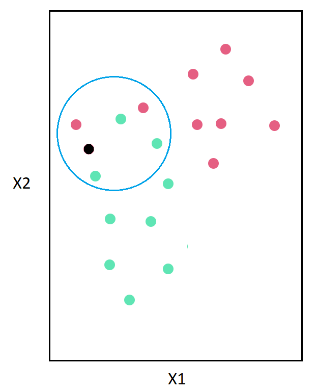

## José Fernando Zea (ML - Konrad Lorenz)
# Motivación

Existen varios algoritmos que intentan darle solución a los problemas de clasificación utilizando una especificación paramétrica (como las regresiones logísticas, los árboles de clasificación y las redes neuronales). Estos modelos tratan de encontrar el valor óptimo de sus parámetros, de tal manera que las funciones ajustadas puedan ser utilizadas para predicción. 

A continuación se estudiará un algoritmo llamado K-Vecinos Más Cercanos, (KNN K-Nearest Neighborhoods, por sus siglas en inglés), que utiliza la información de las $k$ observaciones más cercanas para predecir la categoría a la que corresponde un individuo desconocido. 

# Descripción de la Técnica

Partiendo del supuesto de que individuos similares se agruparán cerca unos a otros, KNN permite predecir la clase de una observación no vista anteriormente. 

Suponga que tine una muestra de individuos que pueden padecer de una enfermedad o no. Para cada uno de ellos usted posee dos características, $x_1$ y $x_2$, con las cuales predecir la presencia de la enfermedad. Los puntos rojos representan individuos que han contraído la enfermedad, mientras que los puntos verdes representan aquéllos que están sanos.

```{r, out.width = "200px", echo=FALSE, fig.align='center'}
knitr::include_graphics("ex1.png")
```

Si se quisiera predecir la clase de una observación nueva, KNN buscaría los K puntos más cercanos a ella para encontrar la clase dominante del grupo.\footnote{Teniendo esto en mente, para garantizar la existencia de una clase dominante $K$ debe ser un número impar.} De esta forma, aquella clase que domine será la predicción para la observación. 

En el ejemplo, se utilizarían las cinco observaciones más cercanas ($K = 5$), para determinar si el nuevo individuo (punto negro) padece o no de la enfermedad.

```{r, out.width = "200px", echo=FALSE, fig.align='center'}

```

Como se puede observar, dentro de la circunferencia existen tres casos negativos (verdes) y dos positivos (rojos). Como la mayoría de los individuos no padecen la enfermedad, se predice que el nuevo individuo no padece la enfermedad. 

# Ejemplo 1 - Iris Dataset

Para ilustrar el poder de KNN se utilizará el Iris Dataset, que contiene información sobre el largo y ancho de pétalos y tallos de tres tipos de flores. 

```{r}
data(iris)

plot(iris$Petal.Length, iris$Petal.Width, 
     pch=21, bg=c("red","green","blue")[unclass(iris$Species)], 
     main="Iris Dataset", xlab = "Petal Length", ylab = "Petal Width")
```
A continuación se utilizará el paquete \texttt{class} para encontrar los 3 vecinos más cercanos a cada punto. 

```{r message = FALSE, warning = F}

# Se definen los conjuntos de entrenamiento y validación 
set.seed(171020)
indices_entrenamiento = sample(1:nrow(iris), 0.7 * nrow(iris))
indices_prueba = setdiff(1:nrow(iris), indices_entrenamiento)

# Utilizando los índices se conforman los conjuntos de datos.

datos_entrenamiento = iris[indices_entrenamiento,]
datos_prueba = iris[indices_prueba,]


# A continuación se utiliza la librería para realizar KNN

library("class")

# La función toma por aparte las características (X) y las clases (Y)
train = datos_entrenamiento[, -5]
train_lab = datos_entrenamiento[, 5] #Y

test = datos_prueba[, -5]
test_lab = datos_prueba[, 5]

# Arroja la predicción para los datos de test
preds = knn(train = train, test = test, cl=train_lab, k = 3)

# Si se tabula la predicción (preds) con las clases originales se tiene...

matriz_confusion = function(Real, Predicted){
  conf = table(Real, Predicted)
  accuracy = mean(ifelse(Predicted == Real, 1, 0))
  return(list("ConfusionMatrix"= conf, "Accuracy" = accuracy))
}

matriz_confusion(test_lab, preds)
```

La matriz de confusión muestra que el algoritmo se equivocó con apenas 2 observaciones, las cuales clasificó como Virginica siendo Versicolor. Sin embargo su desempeño es adecuado, pues tiene una precisión del 95% sobre los datos de prueba. 

```{r}
X <- data.frame(Sepal.Length = c(5.15, 4.8), Sepal.Width = c(3.7, 2.9),
                Petal.Length = c(1.38, 1.39), Petal.Width = c(0.25, 0.21))
knn(train = train, test = X, cl=train_lab, k = 3)
```


Si entrenara con sólo dos variables (del patalo)

```{r}
X <- data.frame(Petal.Length = c(1.38, 1.39), Petal.Width = c(0.25, 0.21))
knn(train = train[,c(3,4)], test = X, cl=train_lab, k = 3)
```


# Ejemplo 2 - Sufragio

Durante periodos electorales suelen salir muchas encuestas que permiten conocer la intención de voto de los colombianos. Sin embargo, es difícil saber si las personas encuestadas van a votar realmente. 

Con el objetivo de conocer la verdadera capacidad predictiva de las intenciones de voto, puede construirse un modelo que clasifique a las personas encuestadas en abstencionistas o sufragantes. De esta forma, se puede informar más detalladamente a la comunidad. 

Para esto, se construirá un modelo de KNN utilizando la encuesta de Cultura Política del DANE. En este modelo se incluirán variables sociodemográficas (edad, sexo, religión y habilidades lectoescritoras), afinidad a la política (partidos políticos y democracia), e información respecto a la posición respecto al sufragio.

```{r message = FALSE}
library(readr)
caracs = read_delim("caracs.txt", "\t")
democracia = read_delim("democracia.txt", "\t")
elecciones = read_delim("elecciones.txt", "\t")

datos = merge(caracs, democracia, c("DIRECTORIO", "HOGAR_NUMERO", 
                                    "PERSONA_NUMERO"))
datos = merge(datos, elecciones, c("DIRECTORIO", "HOGAR_NUMERO", 
                                   "PERSONA_NUMERO"))

# ¿Cuando hay elecciones usted vota? 1 = Sí, 0 = No.

datos$vota = factor(as.numeric((ifelse(datos$P5335 != 2, 
                                       datos$P5335, NA) - 2 ) > 0))

# ¿Se identifica con algún partido político? 1 = Sí, 0 = No.
datos$partido = 2 - datos$P5323

# ¿Se encuentra afiliado a un partido político? 1 = Sí, 0 = No.
datos$afiliado = 2 - datos$P5326
# ¿Cómo se siente con la forma en que funciona la democracia
# en Colombia?

datos$democol = factor(ifelse(datos$P5301 != 99, datos$P5301, NA))

# ¿Se informa sobre la actualidad política del país?
datos$infor = 2 - datos$P517

# Sexo. 1 = Mujer, 0 = Hombre

datos$sexo = datos$P220 - 1

# Edad
datos$edad = datos$P5785

# ¿Practica alguna religión?
datos$religion = ifelse(datos$P6945 == 4 | datos$P6945 == 9, 1, 
                        ifelse(datos$P6945 == 99, NA, 0))

# ¿Sabe leer y escribir? 1 = Sí, 0 = No
datos$lecto = 2 - datos$P6160

datos = datos[, c("vota", "partido", "afiliado", "democol", "infor", "sexo", 
                  "edad", "religion", "lecto")]

datos = datos[complete.cases(datos),]
```

Con esta información se crearán los conjuntos de entrenamiento y prueba. Utilizando esta información se escogerá el $k$ óptimo para predicción. 

```{r message = FALSE, warning = F}

# Se definen los conjuntos de entrenamiento y validación 

set.seed(8)
indices_entrenamiento = sample(1:nrow(datos), 0.7 * nrow(datos))
indices_prueba = setdiff(1:nrow(datos), indices_entrenamiento)

# Utilizando los índices se conforman los conjuntos de datos.

datos_entrenamiento = datos[indices_entrenamiento,]
datos_prueba = datos[indices_prueba,]

train = datos_entrenamiento[, -1]
train_lab = datos_entrenamiento[, 1]

test = datos_prueba[, -1]
test_lab = datos_prueba[, 1]
```

Se crearán varios modelos de KNN y se escogerá el que tenga el menor error de clasificación sobre el conjunto de datos de entrenamiento.

```{r}
max_k = 4
error = matrix(,max_k, 2)

for (K in 1:max_k){
  preds = knn(train = train, test = test, cl=train_lab, k = K)
  error[K, 1] = K 
  error[K, 2] = 1 - mean(preds == test_lab)
}

plot(error, type = "l", xlab = "K", ylab = "Error de Clasificación", 
     main = "K-Nearest Neighbors", col = "blue")
```

Observamos que con $k = 3$ se consigue un error de 14.08%, y por tanto un accuracy de 85.92% sobre el conjunto de prueba. De esta forma, se podría utilizar el kNN para predecir si las personas encuestadas votarán o serán parte de los colombianos que se abstienen. 

# Ejemplo 3 - Insatisfacción Laboral

Suponga que usted ha sido contratado por una consultora para desarrollar un modelo que le permita a las empresas saber si sus empleados pueden estar sintiendo insatisfacción con su puesto actual. Como la información de las empresas es privada, usted se las arregla para utilizar la Gran Encuesta Integrada de Hogares de 2016 y crear un modelo con preguntas que cualquier empleado (o empresa) puede responder. 

Las variables de las que dispone son las siguientes:

\begin{enumerate}
\item[\textbf{1.}] \textbf{Satisfecho:} ¿El trabajador se siente satisfecho con su empleo actual? Sí = 1, No = 0.
\item[\textbf{2.}] \textbf{Cambiar:} ¿Siente que quiere cambiar de trabajo? Sí = 1, No = 0.
\item[\textbf{3.}] \textbf{Caja:} ¿Se encuentra afiliado a caja de compensación? Sí = 1, No = 0.
\item[\textbf{4.}] \textbf{Salario:} ¿Cuánto gana por concepto de salario?
\item[\textbf{5.}] \textbf{Horas:} ¿Cuántas horas trabaja a la semana?

\end{enumerate}

```{r}
trabajo = read.delim("trabajo.txt")

# ¿Está satisfecho con su trabajo? 1 = Sí, 0 = No
trabajo$satisfecho = ifelse(trabajo$P7170S1 <= 2, 2- trabajo$P7170S1, NA)

# ¿Desea cambiarse de trabajo? 1 = Sí, 0 = No
trabajo$cambiar = 2 - trabajo$P7130

# ¿Tiene caja de compensación? 1 = Sí, 0 = No
trabajo$caja = ifelse(trabajo$P9450 <= 2, 2- trabajo$P9450, NA)

# Ingresos por el trabajo
trabajo$salario = trabajo$P6500

# Horas de trabajo semanal
trabajo$horas = trabajo$P6800

trabajo = trabajo[, c("satisfecho", "cambiar", "caja", "salario", "horas")]
trabajo = trabajo[complete.cases(trabajo), ]
```

### Solución posible

```{r}
# Se crean los conjuntos de entrenamiento y de validación 

set.seed(1234)
indices_entrenamiento = sample(1:nrow(trabajo), 0.7 * nrow(trabajo))
indices_prueba = setdiff(1:nrow(trabajo), indices_entrenamiento)

# Utilizando los índices se conforman los conjuntos de datos.

datos_entrenamiento = trabajo[indices_entrenamiento,]
datos_prueba = trabajo[indices_prueba,]

train = datos_entrenamiento[, -1]
train_lab = datos_entrenamiento[, 1]

test = datos_prueba[, -1]
test_lab = datos_prueba[, 1]

# Se implementa el algoritmo con un K máximo de 10
max_k = 10
error = matrix(,max_k, 2)

for (K in 1:max_k){
  preds = knn(train = train, test = test, cl=train_lab, k = K)
  error[K, 1] = K 
  error[K, 2] = 1 - mean(preds == test_lab)
}

plot(error, type = "l", xlab = "K", ylab = "Error de Clasificación", 
     main = "K-Nearest Neighbors", col = "red")
```

En este caso se observa que utilizando todas las variables, se encuentra que el menor error de clasificación utilizando $k = 5$. De esta forma, se tiene un modelo con un accuracy de 87.44%.
